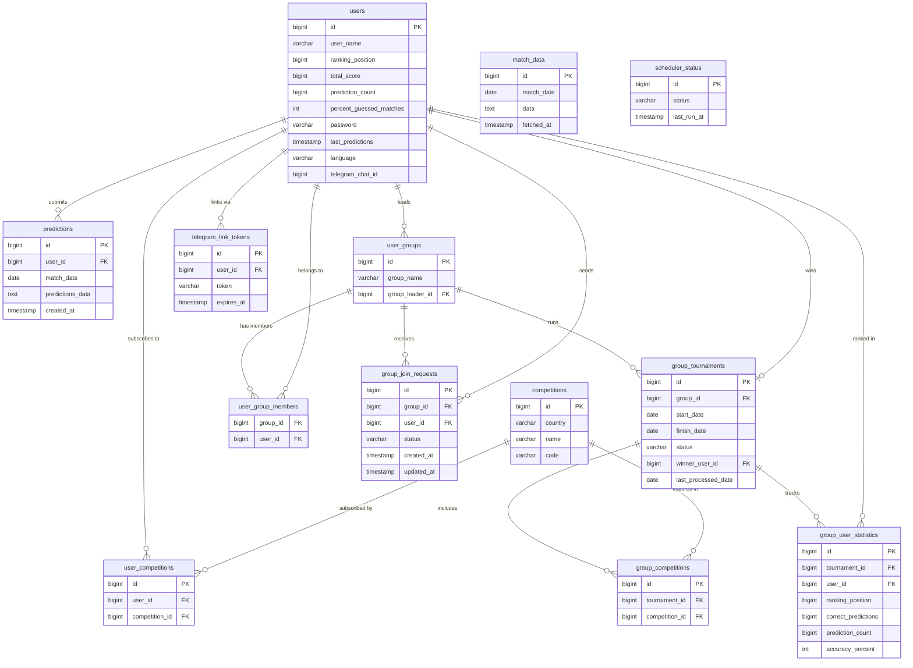

# Sport Predictions

A web application for predicting the outcomes of real football matches. Play solo or compete with friends in private groups — no money, no gambling, just football knowledge.

> **Disclaimer:** This project is non-commercial and intended purely for entertainment and personal development purposes. It does not involve betting, wagering, or any form of monetary transactions.

---

## What Is This?

Sport Predictions lets you guess the results of real upcoming football matches pulled live from the [football-data.org](https://www.football-data.org/) API. You submit your predictions before matches start, and the system automatically scores them once results are in.

You can play on your own (global leaderboard) or create / join a **private group** with friends and compete within a **tournament** — a defined period with selected competitions (leagues) tracked together. Each tournament has a start date, end date, and a winner determined by accuracy.

---

## How It Works

1. **Register** and choose which football competitions (leagues) you want to follow.
2. **Submit predictions** for today's or upcoming matches before kick-off.
3. The **daily scheduler** automatically fetches real match results and scores your predictions.
4. Your **global stats** (total score, accuracy %, ranking) update automatically.
5. Optionally: **create or join a group**, set up a **tournament** with specific competitions and a date range, and compete against your friends on a separate group leaderboard.
6. Link your **Telegram** account to receive match-day and result notifications.

### Scoring

A prediction is counted as **correct** when the guessed outcome (home win / draw / away win) matches the actual full-time result. The more correct predictions, the higher you climb on the leaderboard.

---

## Football Data API

Match and competition data is fetched from:

```
https://api.football-data.org/v4
```

If you want to run this project yourself, you need to **register at [football-data.org](https://www.football-data.org/)** and obtain your own free API key. Set it as an environment variable:

```
FOOTBALL_API_KEY=your_key_here
```

The free tier provides access to a limited set of top competitions (Premier League, La Liga, Bundesliga, etc.), which is sufficient for the default configuration.

---

## Database Schema

The diagram below shows all tables and their relationships.



---

## Tech Stack

| Layer | Technology |
|---|---|
| Language | Java 17 |
| Framework | Spring Boot 3.4 |
| REST API | Spring MVC + Spring WebFlux (WebClient) |
| Security | Spring Security + JWT (JJWT 0.12) |
| Persistence | Spring Data JPA + Hibernate |
| Database | PostgreSQL |
| Migrations | Flyway |
| Frontend | Thymeleaf + Vanilla JS |
| API Docs | SpringDoc OpenAPI (Swagger UI) |
| Notifications | Telegram Bot API |
| Build tool | Maven |
| Utilities | Lombok, Jackson, jBCrypt |

### Key architectural decisions

- **Stateless auth** — JWT tokens, no server-side session storage.
- **Daily scheduler** — a cron job fetches match results once a day, scores all pending predictions, recalculates global and group rankings, and finalizes completed tournaments.
- **Match data caching** — raw API responses are stored in the `match_data` table to avoid redundant external calls and stay within API rate limits.
- **Multi-tournament groups** — a group can run multiple tournaments sequentially, each with its own date range, competition set, and winner.
- **Flyway migrations** — schema changes are version-controlled and applied automatically on startup.
- **i18n** — UI supports English and Ukrainian; language preference is stored per user and persisted across sessions.

---

## Configuration

The application is configured via environment variables. Create a `.env` file or set these in your run configuration:

```env
# Database
SPRING_DATASOURCE_URL=jdbc:postgresql://localhost:5432/sport_predictions
SPRING_DATASOURCE_USERNAME=your_db_user
SPRING_DATASOURCE_PASSWORD=your_db_password

# Football API (register at football-data.org)
FOOTBALL_API_KEY=your_api_key
FOOTBALL_API_BASE_URL=https://api.football-data.org/v4
FOOTBALL_API_TOKEN_HEADER=X-Auth-Token

# JWT
JWT_SECRET=your_jwt_secret_min_32_chars

# Telegram Bot (optional, create via @BotFather)
TELEGRAM_BOT_TOKEN=your_bot_token
TELEGRAM_BOT_USERNAME=your_bot_username
```

### Running locally

```bash
# Clone the repository
git clone https://github.com/PavloDymohlo/sportPredictions.git
cd sportPredictions/sportPredictions

# Set environment variables (see above), then:
./mvnw spring-boot:run
```

The application starts on `http://localhost:8080`.
Swagger UI is available at `http://localhost:8080/swagger-ui.html`.

---

## API Documentation

Interactive API documentation is available via Swagger UI at `/swagger-ui.html` when the application is running. All endpoints are grouped by domain: Auth, User, Competition, Prediction, User Group, Statistics, Scheduler, Telegram.

---

## Author

**Pavlo Dymohlo**

- GitHub: [github.com/PavloDymohlo](https://github.com/PavloDymohlo)
- LinkedIn: [linkedin.com/in/pavlo-dymohlo](https://www.linkedin.com/in/pavlo-dymohlo/)
